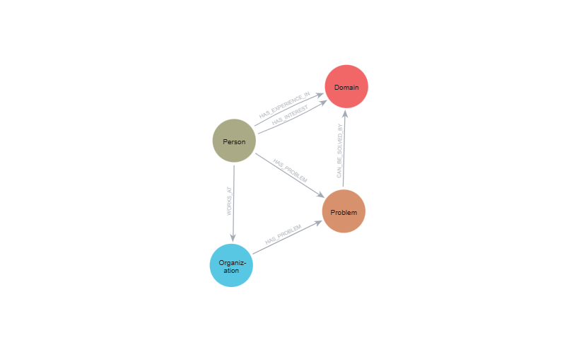

# Quantum Network Knowledge Graph

An open knowledge graph that maps and connects the quantum computing ecosystem initally in LATAM, facilitating the identification of potential collaborations between researchers, organizations, and areas of interest.

---

## Table of Contents

1. [Value Proposition](#value-proposition)
   - [What Problem Does It Solve?](#what-problem-does-it-solve)
   - [Why Does This Project Exist?](#why-does-this-project-exist)
   - [How Do We Use It?](#how-do-we-use-it)
2. [Technical Documentation](#technical-documentation)
   - [Knowledge Graph Model](#knowledge-graph-model)
   - [Technical Architecture](#technical-architecture)
   - [Installation and Usage](#installation-and-usage)
   - [Strategic Query Examples (Cypher)](#strategic-query-examples-cypher)
   - [Project Status](#project-status)
3. [Governance and Privacy](#governance-and-privacy)
   - [Privacy, Ethical Use, and Consent](#privacy-ethical-use-and-consent)
   - [Neutrality and Graph Governance](#neutrality-and-graph-governance)
4. [Contributing](#contributing)
5. [License](#license)
6. [Data Sources](#data-sources)

---

## Value Proposition

### What Problem Does It Solve?

The quantum computing ecosystem in LATAM is growing, but faces critical challenges:

- **Fragmented information**: Information about **who does what** is scattered and difficult to access.
- **Difficulty finding partners**: It's complex to identify **suitable partners** for R&D projects or industrial pilots.
- **Disconnection between problems and capabilities**: There are many **industrial pain points** without clear connection to available academic or technical capabilities.

**Quantum Network Knowledge Graph seeks to answer:**

> "How do we connect real problems with the people and organizations that can solve them?"

### Why Does This Project Exist?

This project is born under **QNOW's philosophy** as a company focused on **knowledge mining** and **generation of new knowledge**.

Instead of merely storing event data, this public project builds an **open semantic layer** that:




- Represents people, organizations, domains, and problems as connected nodes.
- Makes explicit the relationships between interests, experience, and needs.
- Enables intelligent agents, analysis tools, and other systems to explore the quantum computing ecosystem in LATAM in a structured way, and on which knowledge will be mined and generated in the quantum computing domain.

The goal is for **any system that can consume semantic relationships** to obtain:

- **Source of truth** about who does what in quantum computing in LATAM.
- **Map of pain points, interests, and capabilities** of the ecosystem.
- **Shared infrastructure** to accelerate collaborations, applied research, and technology transfer.

### How Do We Use It?

#### For People and Organizations

The graph enables answering strategic queries such as:

- **Talent and project matching**
  - "Who has active experience in 'Quantum Machine Learning' and works in the financial sector?"
- **Capability gaps**
  - "In which domains are there many interested people but few with experience?"
- **Industrial pain points**
  - "Which organizations declare 'gap between business and technology' and don't have internal experts in the domains that could solve it?"
- **Intelligent networking**
  - "Which people share multiple domains of interest but work in different organizations?"

#### For Intelligent Agents and Systems

Any agent that can execute Cypher queries against Neo4j can:

- Answer questions about the ecosystem in a structured way.
- Suggest **potential collaborations**, finding people with common interests who are not yet organizationally connected.
- Detect **gaps** between declared problems and available capabilities.

In practice, an agent can:

1. Receive a question from a user.
2. Translate it to a Cypher query on the graph.
3. Interpret the results and generate recommendations, insights, or summaries.

#### Integration with QNOW and Other Systems

Under QNOW's philosophy as a company focused on **knowledge mining and generation**, QNK Graph is:

- A **public infrastructure** that enriches our services:
  - Research as a Service (RaaS),
  - Quantum use case design,
  - Team building and collaboration networks.
- An **open semantic layer** that any system can consume:
  - Agents orchestrated  for instance could leverage this knowledge to fin the best talent for the rigth problem.
  - Ecosystem analysis dashboards,
  - Program and call planning tools.

---

## Technical Documentation

### Knowledge Graph Model

#### Entities (Nodes)

The graph models the following entities:

- **`Person`**: People in the ecosystem (researchers, students, professionals)
  - Properties: `name`, `email`, `role`, `linkedin_url`, `quantum_experience`, `event_expectations`
- **`Organization`**: Organizations (companies, universities, startups, institutions)
  - Properties: `name`, `industry_sector`
- **`Domain`**: Areas of interest in quantum computing
  - Properties: `name` (e.g., "Academic research", "Use cases in Finance", "Software / algorithm development", "Quantum hardware")
- **`Problem`**: Problems and needs identified from participant expectations
  - Properties: `name` (e.g., "Lack of general knowledge", "Lack of networking", "Lack of information about industrial applications")
  - **Inference**: Problems are automatically inferred from the `event_expectations` field and `quantum_experience` level

#### Relationships

- **`(Person)-[:WORKS_AT]->(Organization)`**: Employment relationship between person and organization
- **`(Person)-[:HAS_INTEREST]->(Domain)`**: Indicates that a person has interest in a specific domain. **This is the main relationship for facilitating conversations and finding people with common interests.**
- **`(Person)-[:HAS_EXPERIENCE_IN]->(Domain)`**: Indicates that a person has practical experience in a domain (only for people with 'active' or 'exploration' experience)
- **`(Person)-[:HAS_PROBLEM]->(Problem)`**: Indicates that a person has a specific problem or need
- **`(Organization)-[:HAS_PROBLEM]->(Problem)`**: Indicates that an organization has a problem (inferred from its employees' problems)
- **`(Problem)-[:CAN_BE_SOLVED_BY]->(Domain)`**: Indicates that a problem can be solved or addressed through a specific domain. This relationship is inferred when a person has both a problem and an interest in a domain.

#### Model Structure

```
Person ──[WORKS_AT]──> Organization
  │
  ├──[HAS_INTEREST]──> Domain
  │
  ├──[HAS_EXPERIENCE_IN]──> Domain (only if has active/exploration experience)
  │
  └──[HAS_PROBLEM]──> Problem

Organization ──[HAS_PROBLEM]──> Problem (inherited from employees)

Problem ──[CAN_BE_SOLVED_BY]──> Domain
```

#### Inferred Problem Categories

The system automatically infers the following problem categories from participant expectations:

- **Lack of general knowledge**: Need for general knowledge about quantum computing
- **Lack of updates**: Need to stay updated with the latest developments
- **Lack of networking**: Need for professional connections
- **Lack of information about applications**: Need for information about applications and use cases
- **Lack of information about technological maturity**: Need to understand the state of technology maturity
- **Lack of information about viability**: Need to understand viability and feasibility
- **Lack of information about industrial applications**: Need for information about specific industrial applications
- **Lack of collaboration opportunities**: Need for collaboration opportunities
- **Lack of information about labor demand**: Need for information about the job market
- **Lack of information about products**: Need for information about available products
- **Lack of implementation ideas**: Need for ideas to implement quantum technologies
- **Gap between business and technology**: Gap between business needs and technological capabilities

### Technical Architecture

#### ETL Pipeline

The project includes a complete ETL pipeline implemented in Python that processes CSV data and loads it into Neo4j:

- **Extract**: Data loading from CSV file
- **Transform**: Data normalization and cleaning (text, LinkedIn URLs, experience categorization, **problem inference**)
- **Load**: Structured insertion into Neo4j using Cypher queries (includes creation of Problem nodes and relationships)

#### Visualization

Includes an interactive web interface built with React and Neo4j NVL to visualize and explore the graph:

- Interactive visualization of nodes and relationships
- Detailed information panel per node
- Filtering and search of entities
- Graph data export

#### Technologies

- **Backend**: Python 3.12+, Neo4j, pandas
- **Frontend**: React, Neo4j NVL
- **Database**: Neo4j (knowledge graph)

### Installation and Usage

#### Requirements

- Python 3.12+
- Neo4j (local or Neo4j Aura)
- Node.js (for the visualization interface)

#### Configuration

1. Configure environment variables for Neo4j:

   ```
   NEO4J_URI=
   NEO4J_USER=neo4j
   NEO4J_QUANTUM_NETWORK_AURA=
   ```
2. Run the ETL pipeline:

   ```bash
   python src/pipeline/etl_to_graph.py
   ```
3. Start the visualization interface:

   ```bash
   cd src/app/ui
   npm install
   npm start
   ```

### Strategic Query Examples (Cypher)

Below are some useful questions and how to answer them in Cypher. This cpuld be executed agains the Aura instance.

#### 1. People with Active Experience in a Specific Domain and Sector

**Question:**

> Which people have active experience in "Quantum Machine Learning" and work in organizations in the "Finance" sector?

```cypher
MATCH (p:Person)-[:HAS_EXPERIENCE_IN]->(d:Domain),
      (p)-[:WORKS_AT]->(o:Organization)
WHERE d.name = "Quantum Machine Learning"
  AND o.industry_sector = "Finanzas"
  AND p.quantum_experience IN ["active", "exploration"]
RETURN p.name AS person,
       p.role AS role,
       o.name AS organization,
       o.industry_sector AS sector,
       d.name AS domain
ORDER BY person;
```

#### 2. Organizations with "Business-Technology Gap" and Low Internal Capacity

**Question:**

> Which organizations have the problem "Gap between business and technology" and don't have people with active experience in the domains that can solve it?

```cypher
MATCH (org:Organization)-[:HAS_PROBLEM]->(prob:Problem {name: "Gap entre negocio y tecnología"})
MATCH (prob)-[:CAN_BE_SOLVED_BY]->(d:Domain)
WHERE NOT EXISTS {
  MATCH (p:Person)-[:WORKS_AT]->(org),
        (p)-[:HAS_EXPERIENCE_IN]->(d)
  WHERE p.quantum_experience IN ["active", "exploration"]
}
RETURN org.name AS organization,
       prob.name AS problem,
       collect(DISTINCT d.name) AS relevant_domains;
```

#### 3. People Who Share Interests with a Given Person (Potential Collaborations)

**Question:**

> Given a participant, who shares one or more domains of interest with that person?

```cypher
MATCH (p:Person {email: $email})-[:HAS_INTEREST]->(d:Domain)
MATCH (other:Person)-[:HAS_INTEREST]->(d)
WHERE other <> p
RETURN other.name AS potential_collaborator,
       collect(DISTINCT d.name) AS shared_domains
ORDER BY size(shared_domains) DESC;
```

#### 4. Most Frequent Problems in the Ecosystem

**Question:**

> What are the most frequent problems declared by people?

```cypher
MATCH (p:Person)-[:HAS_PROBLEM]->(prob:Problem)
RETURN prob.name AS problem,
       count(DISTINCT p) AS num_people
ORDER BY num_people DESC;
```

#### 5. Domains with High Interest and Low Experience (Capability Gaps)

**Question:**

> In which domains are there many interested people but few with active experience?

```cypher
MATCH (d:Domain)
OPTIONAL MATCH (p_int:Person)-[:HAS_INTEREST]->(d)
WITH d, count(DISTINCT p_int) AS interested
OPTIONAL MATCH (p_exp:Person)-[:HAS_EXPERIENCE_IN]->(d)
WITH d, interested, count(DISTINCT p_exp) AS experienced
RETURN d.name AS domain,
       interested,
       experienced,
       CASE
         WHEN experienced = 0 THEN interested * 1.0
         ELSE interested * 1.0 / experienced
       END AS interest_experience_ratio
ORDER BY interest_experience_ratio DESC, interested DESC;
```

#### 6. Organizations with Expertise in Quantum Hardware

**Question:**

> Which organizations have people with experience in quantum hardware?

```cypher
MATCH (o:Organization)<-[:WORKS_AT]-(p:Person)-[:HAS_EXPERIENCE_IN]->(d:Domain)
WHERE d.name = "Hardware cuántico"
RETURN o.name AS organization,
       collect(DISTINCT p.name) AS experts,
       count(DISTINCT p) AS num_experts
ORDER BY num_experts DESC;
```

#### 7. Pairs of People with Common Interests Working in Different Organizations

**Question:**

> Which pairs of people share domains of interest but don't work in the same organization? (Potential cross-collaborations)

```cypher
MATCH (p1:Person)-[:HAS_INTEREST]->(d:Domain)<-[:HAS_INTEREST]-(p2:Person)
WHERE id(p1) < id(p2)
  AND NOT EXISTS {
    MATCH (p1)-[:WORKS_AT]->(o:Organization)<-[:WORKS_AT]-(p2)
  }
RETURN p1.name AS person_1,
       p2.name AS person_2,
       collect(DISTINCT d.name) AS shared_domains
ORDER BY size(shared_domains) DESC;
```

## Governance and Privacy

### Privacy, Ethical Use, and Consent

Personal data present in the graph (for example, emails and LinkedIn profiles) comes from **event registrations** for quantum computing events where people participate voluntarily.

#### Usage Principles

- **Networking and collaboration purposes**The graph is designed to facilitate professional connections, research and project development collaborations, not for spam campaigns or intrusive uses.
- **Do not share sensitive data without consent**Contact information should not be published or redistributed en masse without explicit consent from the people involved.
- **No aggressive scraping**If LinkedIn or other network information is integrated in the future:

  - Aggressive scraping techniques will be avoided.
  - **Voluntary import** will be prioritized, for example: "Connect your profile to enrich your node in the graph".
- **Transparency**
  Whenever possible, people will be informed that their data is used to build a map of collaborations in quantum computing, with the goal of strengthening the ecosystem.

> This project seeks to be an open and useful resource for the community, respecting the privacy and autonomy of participating people.

### Neutrality and Graph Governance

As this graph grows and becomes a reference for mapping the quantum computing ecosystem in LATAM, important questions arise:

- Who maintains the data?
- How is the graph updated?
- Are external contributions accepted (PRs, forms, datasets)?

At this initial stage, the graph is maintained by the QNOW team. However, the future vision is:

> As the graph grows, a **governance model** will be defined to ensure quality, continuous updates, and open participation from the ecosystem.

Some guiding principles:

- **Neutrality:** The graph does not seek to prioritize a specific organization, company, or country; its goal is to reflect the ecosystem in an open and transparent way.
- **Data quality:** Contributions that improve quality (corrections, updates, enrichment) will be encouraged over volume alone.
- **Open participation:** Contributions will be accepted via:

  - Pull Requests to the repository (data corrections, new sources).
  - Forms or ingestion pipelines defined publicly.
- **Traceability**
  Whenever possible, the origin of data will be documented (event, form, public source).

---

## Contributing

This project is part of QNOW's mission to map and connect the quantum computing ecosystem in LATAM. Contributions are welcome.

**Invitation:** If you're building something in quantum computing in LATAM, this graph is also yours. We invite you to contribute data, correct, enrich, and use it to create new connections and projects.

## License

See [LICENSE](LICENSE) file for details.

---

## Data Sources

**Initial data source:**

The graph is built from data collected from participants in quantum computing events, starting with the "Interferencia Constructiva" event on November 17, 2025. The data includes:

- Person information: name, email, role, experience in quantum technologies
- Organizational affiliations: organization, industrial sector
- Declared interests: areas of interest in quantum computing (academic research, use cases in finance/health, software/algorithm development, quantum hardware, etc.)
- Professional profiles: LinkedIn URLs (when available)

**Expansion strategies:**

1. **Integration with other knowledge graphs**: Connect with public ontologies of quantum computing, computer science, physics, and mathematics to enrich the semantic context.
2. **Enrichment with public data**: Integrate public knowledge information about quantum computing, academic publications, and research projects.
3. **Connection with professional social networks**: Connect with social networks (LinkedIn) to identify connections between people and expand the relationship graph.
4. **Incorporation of business problems**: Add "Problem" nodes that represent specific industrial challenges and connect them with domains and people who can address them.
5. **Interoperable system**: The model is designed to be interoperable, where `Domain` nodes can represent any set of formalized ontologies from other areas (computer science, physics, mathematics, artificial intelligence, life sciences), facilitating integration with other knowledge systems.
